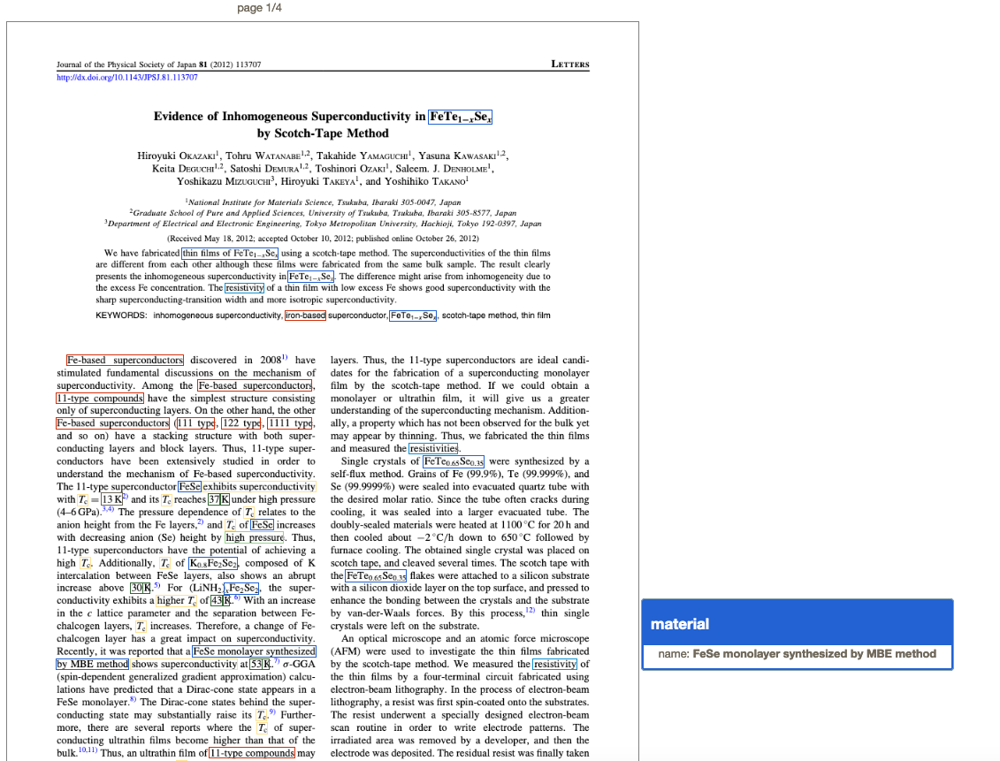

# Grobid superconductors module

[](http://www.apache.org/licenses/LICENSE-2.0.html)


__Work in progress.__

The goal of this GROBID module is to identify and extract entities related to superconductors domain from scientific literature. 
In particular, the goal is to extract superconductors material and their properties, such a Critical Temperature (Tc) 
and any expression or variation, Critical pressure, material name an class.

As the other GROBID models, the module relies only on machine learning and can use linear CRF (via [Wapiti](https://github.com/kermitt2/Wapiti) JNI integration) or Deep Learning model such as BiLSTM-CRF with or without ELMo (via [DeLFT](https://github.com/kermitt2/delft) JNI integration).

 

See the [References](https://github.com/lfoppiano/grobid-superconductors#references) for more information.    

### Getting started

Building module requires maven and JDK 1.8 or greater.  

First install and build the latest development version of GROBID as explained by the [documentation](http://grobid.readthedocs.org).

The modules should be installed inside the grobid directory

> cd grobid 

Clone the grobid-superconductor repository inside the grobid directory 

> git clone ....

> cd grobid-superconductors 

> git submodule init

> git submodule update 

### Build

Copy the provided pre-trained model in the standard grobid-home path:

> cd grobid/grobid-superconductors/

> ./gradlew copyModels 

Try compiling everything with:

> ./gradlew clean build 

Run some test: 

> ./gradlew clean test

### Run
To run the service: 

> java -jar build/libs/grobid-superconductor-{version}.onejar.jar server config/config.yml 

To run the IAA (Inter Annotators Agreement) measurements: 

> java -jar build/libs/grobid-superconductor-{version}.onejar.jar iaa -dIn baseDirectory config/config.yml 

for example: 
> java -jar build/libs/grobid-superconductor-{version}.onejar.jar iaa -dIn baseDirectory resources/dataset/superconductors/guidelines/annotated

## Accuracy

Evaluation made on the 25/01/2020 using 85 papers.
The results (Precision, Recall, F-score) for all the models have been obtained using 10-fold cross-validation (average metrics over the 10 folds). 
We also indicate the best and worst results over the 10 folds in the complete result page.  

| Labels       | CRF        |             |               | BidLSTM+CRF|             |               |
|--------------|------------|-------------|---------------|------------|-------------|---------------|
| Metrics      | Precision  |  Recall     | F1-Score      | Precision  |  Recall     | F1-Score      | 
| <class>      | 74.54      |        66.36|        69.97  |  80.91     |  56.56      |  66.50        |    
| <material>   | 80.82      |        78.91|        79.77  |  80.40     |  84.52      |  82.40        |    
| <me_method>  | 70.54      |        59.53|        64.3   |  55.67     |  62.83      |  58.68        |    
| <pressure>   | 49.33      |        33.06|        35.85  |  81.19     |  61.25      |  68.68        |     
| <tc>         | 78.67      |        73.78|        76.09  |  79.75     |  77.85      |  78.75        |    
| <tcValue>    | 71.09      |        59.56|        64.46  |  55.26     |  57.32      |  56.14        |  
| average      | 70.83      |        61.87|        65.07  |  76.57     |   76.77     |  76.65        |  

All evaluation measures recorded over time, are tracked [here](https://github.com/lfoppiano/grobid-superconductors/tree/master/resources/models/superconductors).
See [DeLFT](http://github.com/kermitt2/delft) for more details about the models and reproducing all these evaluations. 

## Training and evaluation

The grobid home will be used from the default location `../grobid-home`.

### Training only

For training the superconductors model with all the available training data:


> cd PATH-TO-GROBID/grobid/grobid-superconductors/

> ./gradlew train_superconductors

or 

> java -jar build/lib/grobid-supercoductors-*onejar.jar training -a train resources/config/config.yml

The training data must be under ```grobid-superconductors/resources/dataset/superconductors/corpus```. 


### Training and evaluating with automatic corpus split 80/20

The following commands will split automatically and randomly the available annotated data (under ```resources/dataset/software/corpus/```) into a training set and an evaluation set, train a model based on the first set and launch an evaluation based on the second set.
The current implementation only supports 80/20 partition. 

> java -jar build/lib/grobid-supercoductors-*onejar.jar training -a train_eval  resources/config/config.yml

In this mode, by default, 90% of the available data is used for training and the remaining for evaluation. This default ratio can be changed with the parameter `-Ps`. By default, the training will use the available number of threads of the machine, but it can also be specified by the parameter `-Pt`. The grobid home can be optionally specified with parameter `-PgH`. By default it will take `../grobid-home`. 

### Evaluation with n-fold

For n-fold evaluation using the available annotated data (under ```resources/dataset/software/corpus/```), use the command:

> java -jar build/lib/grobid-supercoductors-*onejar.jar training  -a nfold --fold-count n resources/config/config.yml


where `--fold-count` is the parameter for the number of folds, by default 10.  

### Evaluating only

For evaluating under the labeled data under ```grobid-astro/resources/dataset/software/evaluation``` (fixed "holdout set" approach), use the command:

> java -jar build/lib/grobid-supercoductors-*onejar.jar training -a holdout resources/config/config.yml

### Evaluation reports

By default the report is written in files placed in the logs directory under `grobid-superconductors`, to disable the writing on the `log` directory, use the option `--onlyPrint`

> java -jar build/libs/grobid-superconductor-0.1.onejar.jar training -a 10fold -m superconductors --onlyPrint config/config.yml

## Training data
The training data are located in a private repository (for copyright reasons). 
A reduced corpus of Open Access documents will be made available. Feel free to contact us if you need the data.  

## Generation of training data

Grobid supports the automatic generation of pre-annotated training data in XML/TEI, using the current model, 
from a list of text or PDF files in a input repository: 

> java -Xmx4G -jar build/libs/grobid-superconductor-0.1.onejar.jar trainingGeneration -dIn input_directory -dOut output_directory -m superconductors resources/config/config.yml


### Creation of training data for Delft 

It's possible to create training data for delft via command line: 

> java -jar build/libs/grobid-superconductor-0.1.onejar.jar prepare-delft-training --delft /delft/root/path -m superconductors config/config.yml

or with a general output directory 

> java -jar build/libs/grobid-superconductor-0.1.onejar.jar prepare-delft-training --output /a/directory -m superconductors config/config.yml


## Acknowledgement 

Our warmest thanks to @kermitt2 ([Science-miner](http://www.science-miner.com)): Author of [Grobid](http://github.com/kermitt2/grobid), [Delft](http://github.com/kermitt2/delft) and tons of other interesting open source projects. 

This project is developed at the [National Institute for Materials Science](http://www.nims.go.jp), in [Tsukuba](https://en.wikipedia.org/wiki/Tsukuba,_Ibaraki), Japan.  
## License

GROBID and grobid-superconductors are distributed under [Apache 2.0 license](http://www.apache.org/licenses/LICENSE-2.0). 

Contact: Luca Foppiano (FOPPIANO.Luca __AT__ nims.go.jp)


## References

The system is described in the following articles (the latest on top): 

- "Proposal for Automatic Extraction of Superconductors properties from scientific literature": [PDF](http://pubman.nims.go.jp/pubman/faces/viewItemOverviewPage.jsp?itemId=escidoc:1890245:3)
```
@inproceedings{foppiano2019proposal,
	address = {Tsukuba},
	title = {Proposal for {Automatic} {Extraction} {Framework} of {Superconductors} {Related} {Information} from {Scientific} {Literature}},
	volume = {119},
	copyright = {All rights reserved},
	abstract = {The automatic collection of materials information from research papers using Natural Language Processing (NLP) is highly required for rapid materials development using big data, namely materials informatics (MI). The difficulty of this automatic collection is mainly caused by the variety of expressions in the papers, a robust system with tolerance to such variety is required to be developed. In this paper, we report an ongoing interdisciplinary work to construct a system for automatic collection of superconductor-related information from scientific literature using text mining techniques. We focused on the identification of superconducting material names and their critical temperature (Tc) key property. We discuss the construction of a prototype for extraction and linking using machine learning (ML) techniques for the physical information collection. From the evaluation using 500 sample documents, we define a baseline and a direction for future improvements.},
	language = {eng},
	booktitle = {Letters and {Technology} {News}, vol. 119, no. 66, {SC}2019-1 (no.66)},
	author = {Foppiano, Luca and Thaer, M. Dieb and Suzuki, Akira and Ishii, Masashi},
	month = may,
	year = {2019},
	note = {ISSN: 2432-6380},
	pages = {1--5}
}
```
