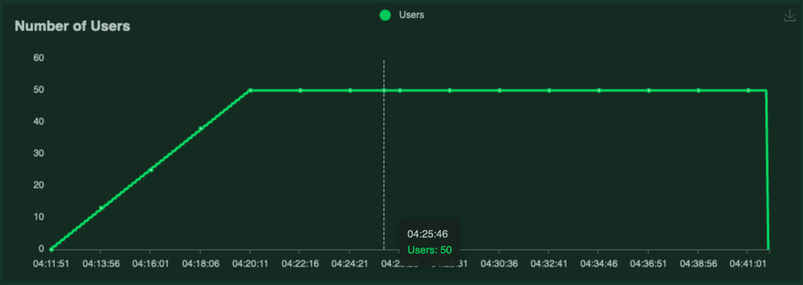

# Grobid-superconductors performance tests 

The tests are performed via a sister package [grobid-superconductros-performances](https://github.com/lfoppiano/grobid-superconductors-performance) (bear in mind that the data is not publicly available)

The test is designed as follow: `30 minutes, ramping up the concurrent users from 1 to 50 with a rate of 0.1 user per second (after 500 seconds all the users will be spawned).`

The system is limited to maximum 6 concurrent requests, and will return 503 if this limit is passed.

The servers used for testing are as follows:
- yomite: GPU Tesla P100-PCIE 16Gb, 24 CPUs, 96Gb of Ram
- falcon: GPU Quadro P2000 5Gb, 12 CPUs, 64Gb of Ram

| name/description                  | server            | architecture          | RPS       | FPS       | Report                                                                        |
|--------                           |----------------   |-------                |-------    |-------    |----------                                                                     |
| process text                      | falcon            | CRF                   | 6.2       | 0.0       | [open](reports/falcon-30m-50u,only_text,crf.pdf)                             |
| process text, batch_size=1000     | falcon            | BidLSTM_CRF_FEATURES  | 6.1       | 0.0       | [open](reports/falcon-30m-50u,only_text,bidlstm_crf,batch_size=1000.pdf)     |                                      |
| process text, batch_size=1000     | yomite            | BidLSTM_CRF_FEATURES  | 6.1       | 0.0       | [open](reports/yomite-30m-50u,only_text,bidlstm_crf,batch_size=1000.pdf)     |
| process text, batch_size=1000     | falcon            | scibert               | 1.8       | 0         | [open](reports/falcon-30m-50u-only_text,batch_size=1000.pdf)                 |
| process text, batch_size=1000     | yomite            | scibert               | 4.6       | 0         | [open](reports/yomite-30m-50u-only_text,batch_size=1000.pdf)                 |
| process pdfs                      | falcon            | CRF                   | 1.2       | 0.1       | [open](reports/falcon-30m-50u,only_pdfs,crf.pdf)                             |
| process pdfs, batch_size=1000     | falcon            | BidLSTM_CRF_FEATURES  | 1.2       | 0.1       | [open](reports/falcon-30m-50u,only_pdfs,bidlstm_crf,batch_size=1000.pdf)     |
| process pdfs, batch_size=1000     | yomite            | BidLSTM_CRF_FEATURES  | 1.1       | 0.2       | [open](reports/yomite-30m-50u,only_pdfs,bidlstm_crf,batch_size=1000.pdf)     |
| process pdfs, batch_size=1000     | falcon            | scibert               | 1.0       | 0.9       | [open](reports/falcon-30m-50u,only_pdfs,batch_size=1000.pdf)                 |
| process pdfs, batch_size=1000     | yomite            | scibert               | 1.8       | 0.8       | [open](reports/yomite-30m-50u,only_pdfs,batch_size=1000.pdf)                 |

Terms definition: 
  - process text = each sample is a sentence
  - process pdf = each sample is a PDF document
  - RPS: Rate per second 
  - FPS: Failures per second
